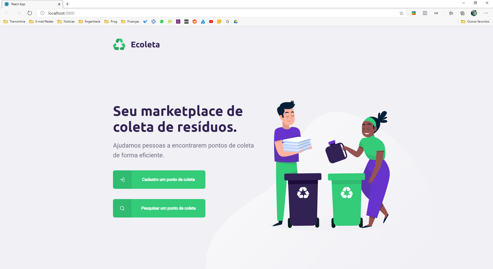
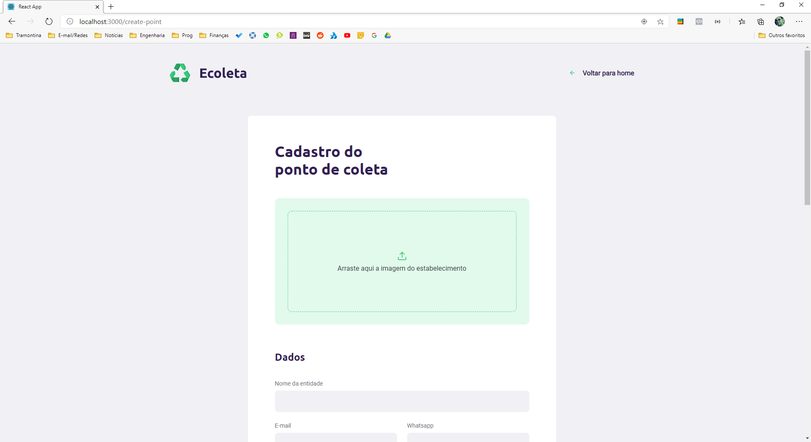
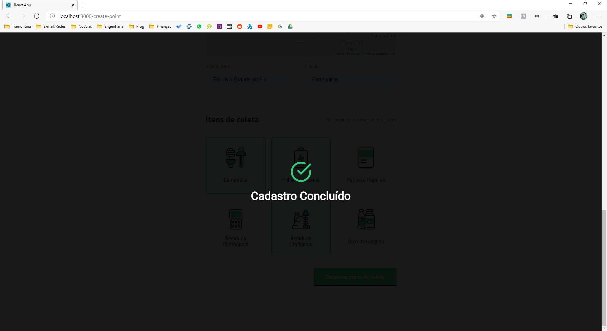
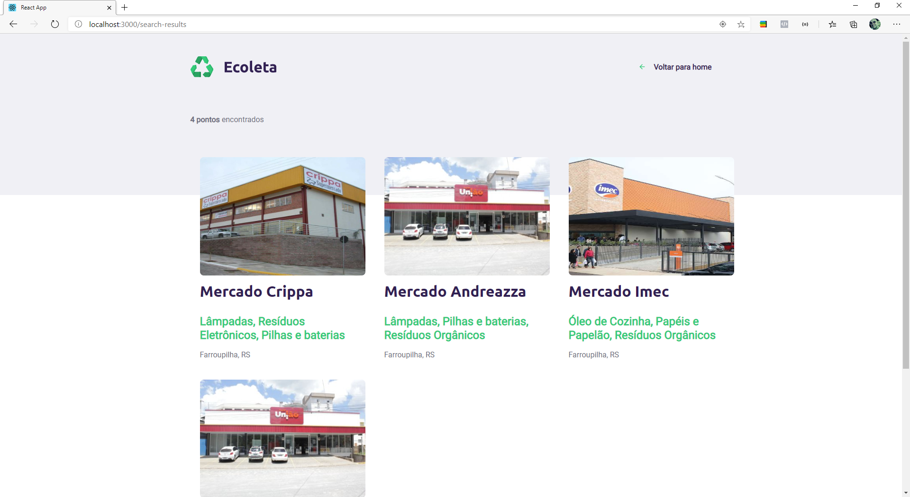

<h1 align="center">
  Ecoleta Application
  
  
</h1>

 - 
 - 
 - 
## Description
  - Application developed for web/mobile during the next level week (event promoted by Rocketseat).

## Web 💻

  
  
  
  
  
  
  

## Mobile 📱

  

## Knowledges 🚀
 - Building the backend using node.js
 - Creating routes to fetch data from the backend
 - Building front-end using ReactJS
 - Creating routes to handle page redirection
 - Handling with data fetched from the backend
 - Building mobile using ReactNative
 - Using external APIs such as <a href="https://servicodados.ibge.gov.br/api/docs/localidades?versao=1">IBGE's API</a>

## Credits 👏
  - <a target="_blank" href="https://rocketseat.com.br">Rocketseat</a>

## Contact ✉
  - <a target="_blank" href="https://www.linkedin.com/in/mateus-campos-deitos-42688864//">LinkedIn</a>
  - <a target="_blank" href="mailto:matdeitos@gmail.com">E-mail</a>
